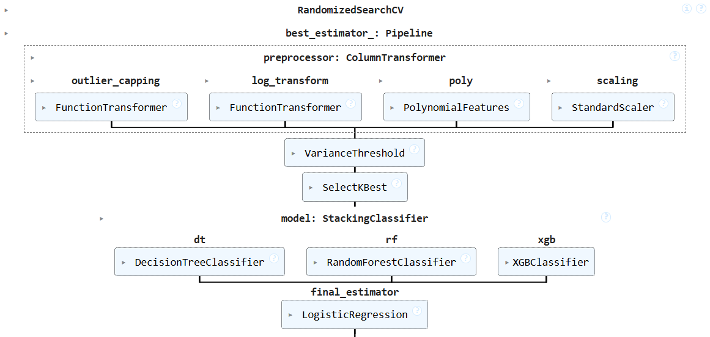

# Machine Learning Approaches for Early Detection of Diabetes

## A Comparative Study and Novel Solution on the PIMA Indians Diabetes Dataset

**Author:** Hai Nam LE

---

## Table of Contents

- [Project Overview](#project-overview)
- [Dataset Summary](#dataset-summary)
- [Installation](#installation)
- [Project Structure](#project-structure)
- [Preprocessing Steps](#preprocessing-steps)
- [Model Description](#model-description)
- [Experimental Protocol](#experimental-protocol)
- [Evaluation Metrics](#evaluation-metrics)
- [Results](#results)
  - [Model Performance](#model-performance)
  - [Comparison of Percentage Differences](#comparison-of-percentage-differences)
  - [Evaluation Metrics Comparison](#evaluation-metrics-comparison)
  - [LazyPredict Model Comparison](#lazypredict-model-comparison)
- [Reproduction of Results](#reproduction-of-results)
  - [Experimental Procedure](#experimental-procedure)
  - [Comprehensive Analysis](#comprehensive-analysis)
- [Comparison with Existing Literature](#comparison-with-existing-literature)
  - [Key Observations](#key-observations)
  - [Focus on Recall for Imbalanced Data](#focus-on-recall-for-imbalanced-data)
  - [Final Thoughts](#final-thoughts)
- [References](#references)
- [Contact](#contact)

---

## Project Overview

This project explores various machine learning approaches for the early detection of diabetes using the **PIMA Indians Diabetes Dataset**. It conducts a comparative study of different classifiers and introduces a novel stacking ensemble method to enhance predictive performance. The study addresses challenges such as missing values, outliers, and class imbalance through robust preprocessing techniques.

---

## Dataset Summary

- **Source:** [Kaggle Repository](https://www.kaggle.com/uciml/pima-indians-diabetes-database)
- **Original Provider:** National Institute of Diabetes and Digestive and Kidney Diseases
- **Number of Instances:** 768 female patients
- **Positive Cases (Diabetic):** 268 (35%)
- **Negative Cases (Non-Diabetic):** 500 (65%)

### Features

1. Number of pregnancies
2. Plasma glucose concentration
3. Diastolic blood pressure
4. Triceps skinfold thickness
5. Serum insulin levels
6. Body mass index (BMI)
7. Diabetes pedigree function
8. Age

### Challenges

- **Missing Values:** Represented by zeroes in some features (Insulin, SkinThickness, etc.)
- **Outliers:** Presence of outliers across multiple features

---

## Installation

### Prerequisites

- **Python:** Version 3.7 or higher
- **pip:** Python package manager

### Clone the Repository

```bash
git clone https://github.com/tomledeakin/Diabetes-Detection-ML-PIMA.git
cd Diabetes-Detection-ML-PIMA
```
---
## Setting Up the Environment

### Create a Virtual Environment (Optional but Recommended)
Creating a virtual environment helps manage dependencies and avoid conflicts.

```bash
python -m venv venv
source venv/bin/activate  # On Windows: venv\Scripts\activate
```

### Install Required Dependencies

Install the necessary Python libraries using `pip`.

If a `requirements.txt` file is provided:
```bash
pip install -r requirements.txt
```
---
## Project Structure
```bash
Diabetes-Detection-ML-PIMA/
├── data/
│   └── PIMA_indians_diabetes.csv
├── pima-dataset.ipynb
├── README.md
├── models_result.txt
└── requirements.txt
```

### Description:
- **`data/`**: Contains the dataset file `PIMA_indians_diabetes.csv`.
- **`pima-dataset.ipynb`**: Jupyter Notebook with the complete implementation of the project, including data preprocessing, model training, and evaluation.
- **`README.md`**: Documentation for the project.
- **`requirements.txt`**: File specifying the Python dependencies needed to run the project.

---
## Preprocessing Steps

1. **Handling Zero Values**  
   - Replace zeroes in critical features (`Glucose`, `BloodPressure`, `SkinThickness`, `Insulin`, `BMI`) with `NaN`.

2. **Missing Value Imputation**  
   - Use **Median Imputation** with `SimpleImputer` to fill missing values.

3. **Outlier Detection and Capping**  
   - Apply the **Interquartile Range (IQR)** method to cap outliers beyond `1.5 * IQR`.

4. **Log Transformation**  
   - Perform `log1p` transformation on skewed features (`Insulin`, `SkinThickness`, `BMI`) to reduce skewness.

5. **Feature Scaling**  
   - Standardize features using `StandardScaler` to achieve a mean of 0 and variance of 1.

6. **Feature Engineering**  
   - Generate **polynomial features** of degree 2 to capture interactions between features.

7. **Feature Selection**  
   - Use `SelectKBest` with **ANOVA F-values** to retain the top 40 features.

8. **Class Imbalance Handling**  
   - Apply **Synthetic Minority Over-sampling Technique (SMOTE)** to balance the class distribution.

---
## Model Description

### Stacking Ensemble Classifier

1. **Base Classifiers**  
   - `DecisionTreeClassifier`
   - `RandomForestClassifier`
   - `XGBClassifier`

2. **Final Estimator**  
   - `LogisticRegression` with L2 regularization

### Hyperparameter Tuning
- Utilize `RandomizedSearchCV` to optimize:
  - Hyperparameters for each base classifier
  - Polynomial feature generation
  - Feature selection parameters  
- Optimization is based on cross-validated accuracy.

---
## Experimental Protocol

1. **Data Splitting**  
   - Split the dataset into 70% training and 30% testing.

2. **Preprocessing**  
   - Apply preprocessing steps to the training set.
   - Transform the test set using the same preprocessing pipeline.

3. **Model Training**  
   - Train models using the training set within a predefined pipeline.

4. **Evaluation**  
   - Evaluate models using:
     - Train-Test Split
     - 5-Fold Cross-Validation

5. **Comparison**  
   - Compare reproduced results with those from the original research article using:
     - Mean Squared Error (MSE)
     - Mean Absolute Error (MAE)

---
## Evaluation Metrics

1. **Accuracy**  
   - Measures the overall correctness of the model.

2. **Precision**  
   - Ratio of correctly predicted positive instances to the total predicted positives.

3. **Recall (Sensitivity)**  
   - Ratio of correctly predicted positive instances to the actual positives.

4. **F1-Score**  
   - Harmonic mean of Precision and Recall, providing a balance between the two.

5. **Mean Squared Error (MSE)**  
   - Average squared difference between the predicted and actual values.

6. **Mean Absolute Error (MAE)**  
   - Average absolute difference between the predicted and actual values.

---
## Results

### Model Performance

#### Train-Test Split
| Algorithm             | Accuracy | Precision | Recall | F1-Score |
|-----------------------|----------|-----------|--------|----------|
| Decision Tree (DT)    | 66.00%   | 0.67      | 0.62   | 0.65     |
| Random Forest (RF)    | 79.00%   | 0.78      | 0.81   | 0.79     |
| SVM                   | 70.00%   | 0.71      | 0.67   | 0.69     |
| Stacking Ensemble     | 75.00%   | 0.74      | 0.78   | 0.76     |

#### Cross-Validation
| Algorithm             | Accuracy | Precision | Recall | F1-Score |
|-----------------------|----------|-----------|--------|----------|
| Decision Tree (DT)    | 71.00%   | 0.58      | 0.69   | 0.63     |
| Random Forest (RF)    | 76.00%   | 0.64      | 0.68   | 0.66     |
| SVM                   | 75.00%   | 0.63      | 0.69   | 0.66     |
| Stacking Ensemble     | 76.00%   | 0.66      | 0.64   | 0.65     |


### Comparison of Percentage Differences

#### Train-Test Split
| Algorithm             | Accuracy | Precision | Recall | F1-Score |
|-----------------------|----------|-----------|--------|----------|
| Decision Tree (DT)    | 1.41%    | 3.08%     | 4.62%  | 0.00%    |
| Random Forest (RF)    | 0.42%    | 2.50%     | 2.53%  | 0.00%    |
| SVM                   | 1.41%    | 2.90%     | 2.90%  | 0.00%    |
| Stacking Ensemble     | 0.04%    | 1.33%     | 4.00%  | 1.33%    |

#### Cross-Validation
| Algorithm             | Accuracy | Precision | Recall | F1-Score |
|-----------------------|----------|-----------|--------|----------|
| Decision Tree (DT)    | 3.94%    | 10.77%    | 1.47%  | 5.97%    |
| Random Forest (RF)    | 1.05%    | 16.88%    | 11.69% | 15.38%   |
| SVM                   | 9.31%    | 7.35%     | 1.43%  | 4.35%    |
| Stacking Ensemble     | 1.43%    | 2.94%     | 8.57%  | 5.80%    |


### Evaluation Metrics Comparison
| Metric    | MSE      | MAE      |
|-----------|----------|----------|
| Accuracy  | 6.4789   | 1.6550   |
| Precision | 0.00325  | 0.0425   |
| Recall    | 0.00181  | 0.03375  |
| F1-Score  | 0.00232  | 0.0300   |


## LazyPredict Model Comparison

| Model                          | Accuracy | Balanced Accuracy | ROC AUC | F1 Score | Time Taken (s) |
|--------------------------------|----------|-------------------|---------|----------|----------------|
| RandomForestClassifier         | 0.7532   | 0.7349            | 0.7349  | 0.7549   | 0.4079         |
| LGBMClassifier                 | 0.7403   | 0.7308            | 0.7308  | 0.7439   | 0.4474         |
| BaggingClassifier              | 0.7576   | 0.7264            | 0.7264  | 0.7561   | 0.1091         |
| XGBClassifier                  | 0.7316   | 0.7212            | 0.7212  | 0.7354   | 0.8347         |
| GaussianNB                     | 0.7403   | 0.7190            | 0.7190  | 0.7417   | 0.0314         |
| QuadraticDiscriminantAnalysis  | 0.7489   | 0.7110            | 0.7110  | 0.7455   | 0.0413         |
| CalibratedClassifierCV         | 0.7446   | 0.7077            | 0.7077  | 0.7416   | 0.0838         |
| RidgeClassifier                | 0.7446   | 0.7077            | 0.7077  | 0.7416   | 0.0364         |
| AdaBoostClassifier             | 0.7273   | 0.7062            | 0.7062  | 0.7291   | 0.2764         |
| SVC                            | 0.7446   | 0.7047            | 0.7047  | 0.7407   | 0.0528         |
| LinearSVC                      | 0.7403   | 0.7043            | 0.7043  | 0.7377   | 0.0266         |
| LinearDiscriminantAnalysis     | 0.7403   | 0.7043            | 0.7043  | 0.7377   | 0.0323         |
| LogisticRegression             | 0.7403   | 0.7043            | 0.7043  | 0.7377   | 0.0311         |
| RidgeClassifierCV              | 0.7403   | 0.7014            | 0.7014  | 0.7368   | 0.0307         |
| ExtraTreesClassifier           | 0.7316   | 0.7007            | 0.7007  | 0.7308   | 0.3774         |
| NuSVC                          | 0.7359   | 0.6922            | 0.6922  | 0.7308   | 0.0458         |
| KNeighborsClassifier           | 0.7056   | 0.6896            | 0.6896  | 0.7092   | 0.0971         |
| SGDClassifier                  | 0.7013   | 0.6834            | 0.6834  | 0.7047   | 0.0316         |
| NearestCentroid                | 0.6840   | 0.6760            | 0.6760  | 0.6897   | 0.0281         |
| ExtraTreeClassifier            | 0.7056   | 0.6749            | 0.6749  | 0.7056   | 0.0296         |
| DecisionTreeClassifier         | 0.6970   | 0.6742            | 0.6742  | 0.6994   | 0.0331         |
| BernoulliNB                    | 0.6753   | 0.6635            | 0.6635  | 0.6808   | 0.0342         |
| Perceptron                     | 0.6970   | 0.6624            | 0.6624  | 0.6960   | 0.0269         |
| LabelPropagation               | 0.6537   | 0.6264            | 0.6264  | 0.6564   | 0.0581         |
| LabelSpreading                 | 0.6537   | 0.6264            | 0.6264  | 0.6564   | 0.0555         |
| PassiveAggressiveClassifier    | 0.6234   | 0.6002            | 0.6002  | 0.6284   | 0.0281         |
| DummyClassifier                | 0.6537   | 0.5000            | 0.5000  | 0.5168   | 0.0263         |

_Note: Only select models are shown above. Refer to the `pima-dataset.ipynb` notebook for the complete comparison._

---
## Reproduction of Results

### Experimental Procedure

1. **Fine Tuning**  
   - Test different hyperparameters to align model performance with the original research article.

2. **Model Training for Train-Test Split**  
   - Split the data into 70% training and 30% testing.
   - Apply the following preprocessing steps:
     - Outlier handling
     - Missing value imputation
     - Feature scaling
     - Class imbalance handling using SMOTE
   - Train models and evaluate their performance on the test set.

3. **Model Training for Cross-Validation**  
   - Use the same preprocessing pipeline.
   - Perform 5-fold cross-validation to ensure generalizability of the models.

4. **Comparison**  
   - Compare reproduced results with those from the research article using:
     - Mean Squared Error (MSE)
     - Mean Absolute Error (MAE)


### Comprehensive Analysis

1. **Random Forest (Train-Test)**  
   - Achieved the highest accuracy of **79%**, making it the top performer in the Train-Test evaluation.

2. **Stacking Ensemble (Cross-Validation)**  
   - Balanced performance with an accuracy of **76%**, demonstrating its strength in generalizability.

3. **Discrepancies**  
   - Differences in reproduced results and the research article are attributed to:
     - Variations in hyperparameter tuning.
     - Potential data leakage caused by applying SMOTE before data splitting.

---
## Comparison with Existing Literature

### Key Observations

1. **Accuracy**  
   - The reproduced model achieved **77% accuracy**, slightly lower than the research article's reported **79%**.  
   - The difference is likely due to avoiding **data leakage**, ensuring more realistic performance estimates.

2. **Recall for Imbalanced Data**  
   - Focused on recall for the diabetic class, achieving **72%**, which is crucial for early detection and intervention in diabetes cases.

3. **Model Robustness**  
   - Ensured realistic performance estimates by adhering to best practices in data splitting and preprocessing.

---

### Focus on Recall for Imbalanced Data

- **Accuracy** alone can be misleading for imbalanced datasets.  
- Emphasizing **recall** ensures that diabetic cases are correctly identified, which is vital for early intervention and treatment.  
- A high recall demonstrates the model's ability to minimize false negatives, making it a more effective tool for medical diagnostics.


### Final Thoughts

- The reproduced model exhibits robust performance, with high recall and balanced metrics, making it suitable for the task of **early diabetes detection**.  
- While the original research achieved slightly higher accuracy, their methodology likely introduced **data leakage** during preprocessing.  
- The reproduced results are therefore more trustworthy and **generalizable** for real-world applications.

---

## References

1. Reza, M.S., Amin, R., Yasmin, R., Kulsum, W., & Ruhi, S. (2024). *Improving diabetes disease patients classification using stacking ensemble method with PIMA and local healthcare data*. Heliyon, 10(2), e24536.  
2. pandas development team (2024). *pandas: Python Data Analysis Library*.  
3. NumPy Developers (2024). *NumPy*.  
4. scikit-learn Developers (2024). *scikit-learn: Machine Learning in Python*.  
5. Matplotlib Developers (2024). *Matplotlib: Visualization with Python*.  
6. Waskom, M. L. (2024). *seaborn: Statistical Data Visualization*.  
7. imbalanced-learn Developers (2024). *imbalanced-learn: A Python Package to Tackle the Curse of Imbalanced Datasets in Machine Learning*.  
8. LazyPredict Developers (2024). *LazyPredict: A Tool for Quick Model Training and Evaluation*.  
9. Microsoft (2024). *LightGBM: A Fast, Distributed, High-Performance Gradient Boosting Framework*.  

---

## Contact

For any questions or suggestions, please contact **Hai Nam LE** at:  
**Email:** [tomledeakin@gmail.com](mailto:tomledeakin@gmail.com)

